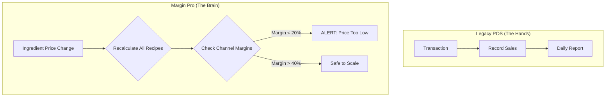

# The Great Misunderstanding

In the chaotic world of F&B, there is a dangerous misconception: *"If I have a POS (Point of Sale), I have data."*

This is technically true, but strategically fatal. 

A POS system is **"The Hands"**. It is designed for speed, execution, and recording transactions. It answers the question: *"What happened?"*
- "We sold 50 lattes."
- "Table 4 paid Rp 250.000."
- "The cash drawer has Rp 5.000.000."

**Margin Pro is "The Brain"**. We are not interested in just recording what happened. We are obsessed with answering: *"Why did it happen, and how do we make it more profitable?"*

## The Blind Spot of Modern POS

Most modern POS systems are excellent at **Operations** but terrible at **Economics**. They treat every dollar of revenue as equal. But as any seasoned restaurateur knows, a dollar from a *Dine-in Coffee* is vastly different from a dollar from a *GrabFood Promo Combo*.

### The Invisible Leak

Let's look at a typical "Blind Spot" scenario that kills thousands of F&B businesses every year.

You sell a **Spicy Chicken Bowl** for **Rp 35.000**.
- **COGS (Ingredients)**: Rp 12.000 (34%)
- **POS Report**: "Gross Margin: 66% (Great Job!)"

The POS pats you on the back. But here is the reality when you look with "The Brain":

1.  **Platform Fee (GoFood/Grab)**: 20% + Rp 1.000 = Rp 8.000
2.  **Packaging**: Rp 1.500
3.  **Promo Participation**: Rp 2.500
4.  **VAT (PB1)**: Rp 3.181 (often miscalculated)

**Real Net Profit**:
$$
35.000 - 12.000 - 8.000 - 1.500 - 2.500 - 3.181 = \mathbf{Rp 7.819}
$$

Your real margin is **22%**, not 66%. If your OpEx (Rent + Staff) is 25%, **you are losing money on every single bowl sold.**

Your POS will never tell you this. It will just say "Sales are up!".

## The Margin Equation

Margin Pro exists to solve this specific blindness. We believe that **Profitability should be engineered, not discovered.**

To do this, we restrict our focus to the **Unit Economics Equation**:

$$ \text{True Margin} = \text{Revenue}_{net} - (\text{COGS}_{fluctuating} + \text{channel}_{cost} + \text{packaging}) $$

We automate this calculation for every single SKU, across every single channel (Gofood, Shopee, Offline, Dine-in).

## Strategic Flow: Inverting the Process

Traditional pricing is **Cost-Plus**:
1.  Calculate Cost (Rp 10k)
2.  Add Markup (50%)
3.  Set Price (Rp 15k)
4.  Hope it works on GoFood. (It won't).

**Margin Intelligence** is **Profit-First**:
1.  Set Target Net Profit (e.g., Rp 5.000/item clear profit).
2.  Select Channel (e.g., GrabFood).
3.  **Algorithm Calculate**: Reverse-engineers the platform fees, tax, and commissions.
4.  **Output**: "You must sell at Rp 26.500 to keep your Rp 5.000 profit."

## Conclusion: Stop Guessing

A surgeon doesn't operate with a butcher knife. A pilot doesn't fly with a speedometer.
Why are you running a billion-rupiah business with just a cash register?

Keep your POS. Let it be the hands that do the work.
But give your business a **Brain**.

**Margin Pro.** Intelligence for the bottom line.
