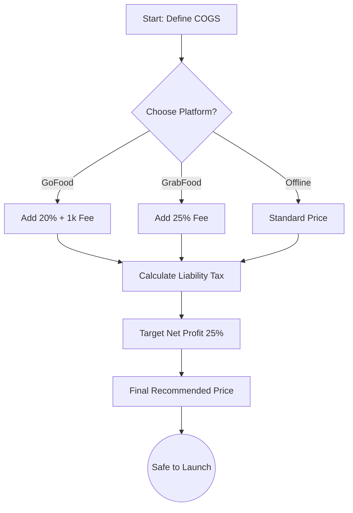

# The Operating Philosophy

In the chaotic world of F&B, tools usually fall into two categories: **Operational** (The Hands) and **Strategic** (The Brain).

A Point of Sale (POS) system is "The Hands". It moves money from the customer's pocket to your drawer. It records *what happened*.

**Margins Pro is "The Brain".** We calculate *why it happened* and *how to make it better*.

## The Margin Equation

Many new business owners confuse **Markup** with **Margin**. Let's define the difference mathematically using LaTeX.

The formula for **Markup** is based on Cost:

$$ \text{Markup} (\%) = \frac{\text{Price} - \text{COGS}}{\text{COGS}} \times 100 $$

But the formula for **Net Margin** (Profitability) is based on Revenue:

$$ \text{Net Margin} (\%) = \frac{\text{Revenue} - (\text{COGS} + \text{OpEx} + \text{Tax})}{\text{Revenue}} \times 100 $$

Crucially, when you involve platforms like ShopeeFood or GoFood, a 30% Markup does **not** cover a 20% Commission.

### The Platform Trap

If you sell a Rice Bowl for Rp 20.000 with a COGS of Rp 12.000.

- **Markup**: $(20k - 12k) / 12k = 66\%$
- **Platform Fee (20%)**: $0.2 \times 20k = 4k$
- **Profit**: $20k - 12k - 4k = 4k$

Your Net Margin is only:
$$ \frac{4.000}{20.000} = 20\% $$

And this is *before* Operational Expenses.

## Strategic Flow

How does Margins Pro help you solve this? We invert the process. You start with your **Target Profit**, and we calculate the required Price.

## Conclusion

Don't just count transactions. Count the profit in every bite. That is the **Margins Pro** way.
